# 🛍️ Shopcrawl (Client)

> **Smart Shopping Starts Here.**
> The React-based frontend for Shopcrawl—an AI-powered store comparison engine that aggregates real-time pricing from Amazon, Jumia, Kilimall, and Shopify.

---

### 📸 Application Screenshots

#### 🏠 Home Page
| Desktop | Mobile |
|:---:|:---:|
| 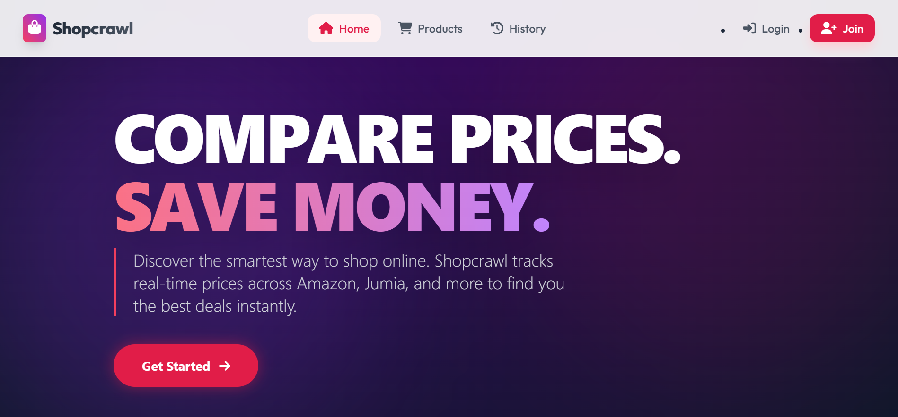 | 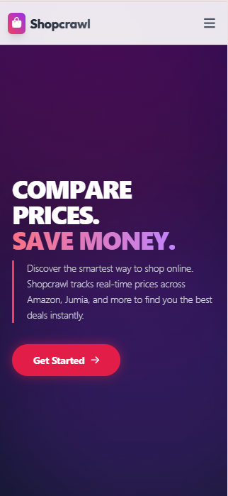 |

#### 🔐 Authentication
| Desktop Login | Mobile Login |
|:---:|:---:|
| 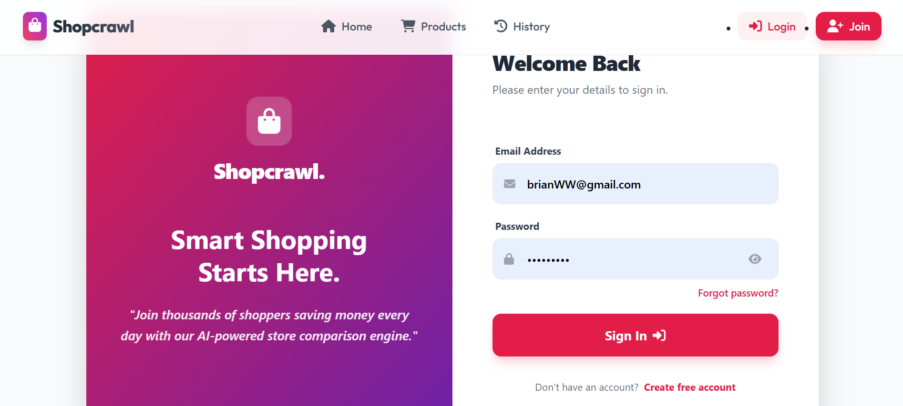 | 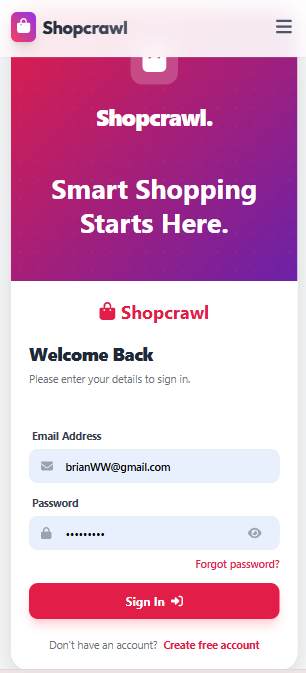 |

#### 🔍 Product Search
| Desktop Results | Mobile Results |
|:---:|:---:|
| 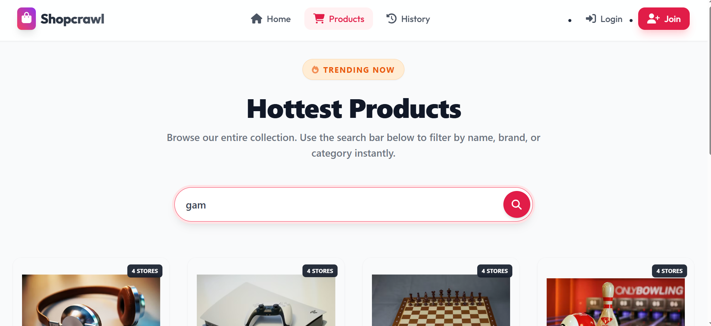 <br> 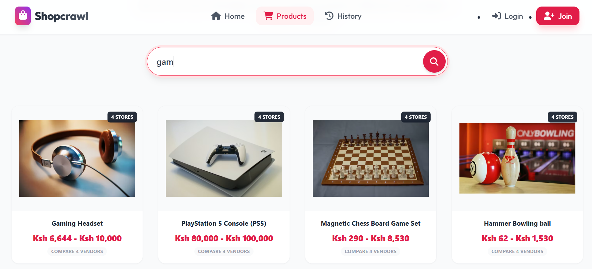 | 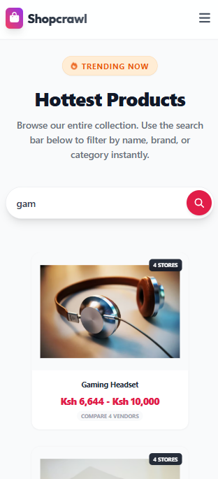 |

#### 🏆 SmartRank™ Analysis
| Desktop Comparison | Mobile View |
|:---:|:---:|
| 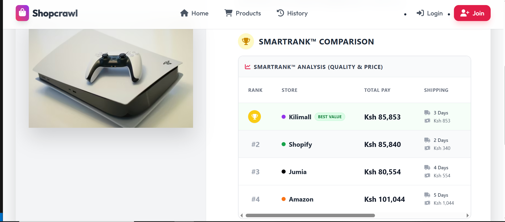 <br> <br> 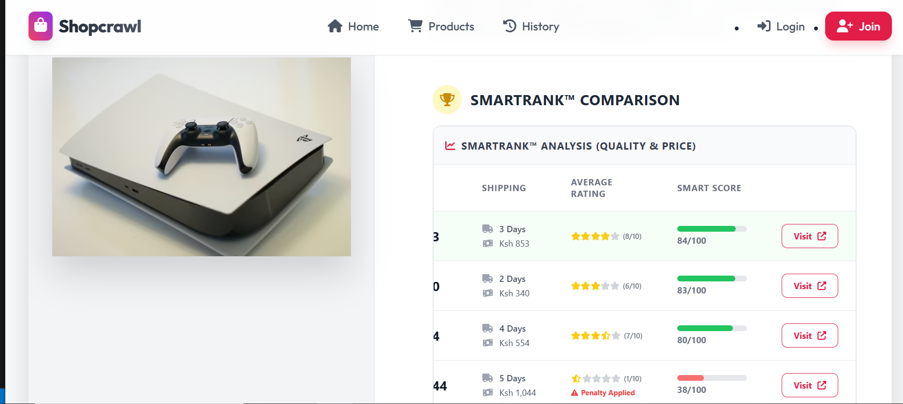 | 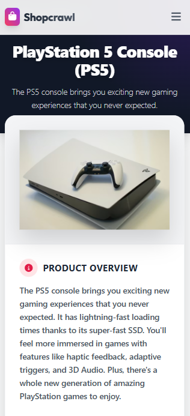 <br> <br> 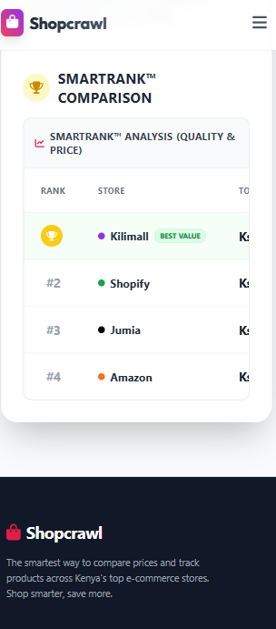 |
---

## 📋 Table of Contents
- [About](#-about)
- [Key Features](#-key-features)
- [Tech Stack](#-tech-stack)
- [Architecture](#-architecture)
- [Getting Started](#-getting-started)
- [API Reference](#-api-reference)
- [Author](#-author)

---

## 📖 About
**Shopcrawl** addresses the fragmentation of e-commerce in Kenya and beyond. Instead of opening four different tabs to check prices on Jumia, Kilimall, or Amazon, Shopcrawl provides a unified search engine. This repository contains the **Frontend** interface, featuring a secure authentication system, search history tracking, and a responsive, mobile-first design.

---

## 🚀 Key Features
* **🔍 Multi-Vendor Search:** Aggregates and compares products from Amazon, Jumia, Kilimall, and Shopify in a single view.
* **🔐 Secure Authentication:** Seamless login interface interacting with the backend's JWT/Token-based auth.
* **📜 Search History:** Visualizes the last 11 viewed items for signed-in users.
* **📱 Mobile-First UI:** Fully responsive design built with Tailwind CSS, ensuring a seamless experience on phones and desktops.
* **⚡ Real-Time Feedback:** Interactive UI with toast notifications for success/error states.

---

## 🛠 Tech Stack

### **Frontend (This Repository)**
* **React.js** (v18) - Component-based UI architecture.
* **Tailwind CSS** - Utility-first styling for rapid, responsive design.
* **React Router** - Single Page Application (SPA) navigation.
* **FontAwesome** - Vector icons.
* **Toastify** - User feedback notifications.

### **Backend (External)**
* **Django REST Framework (DRF)** - Robust API development.
* **Gunicorn & Whitenoise** - Production serving.
* **PostgreSQL** - Data persistence.

---

## 🏗 Architecture
The application follows a decoupled **Client-Server Architecture**:

1.  **Client (Frontend):** Handles user interactions, state management (Auth Context), and API consumption via `fetch`.
2.  **Server (Backend):** Exposes RESTful endpoints, handles business logic, and manages the database.

---

## 🏁 Getting Started

To run the full Shopcrawl application, you need to set up both the **Frontend** (this repo) and the **Backend**.

### Prerequisites
* Node.js & npm
* Python 3.8+ (for Backend)
* Git

### 1. Frontend Setup (This Repo)
```bash
# Clone this repository
git clone [https://github.com/JessyWaweru/SHOPCRAWL-FRONTEND.git](https://github.com/JessyWaweru/SHOPCRAWL-FRONTEND.git)
cd SHOPCRAWL-FRONTEND

# Install Dependencies
npm install

# Start the React Development Server
npm start
```
### 2. Backend Setup(External)
```bash
# Clone the repository
git clone [https://github.com/YOUR_USERNAME/shopcrawl.git](https://github.com/YOUR_USERNAME/shopcrawl.git)
cd shopcrawl/backend

# Create a virtual environment
python -m venv venv

# Activate virtual environment
# On Windows:
venv\Scripts\activate
# On Mac/Linux:
source venv/bin/activate
# Install dependencies
pip install -r requirements.txt

# Run database migrations
python manage.py migrate

# Start the Django server
python manage.py runserver
```
## 📡 API Documentation

| Method | Endpoint | Description | Access |
| :--- | :--- | :--- | :--- |
| **POST** | `/api/users/` | Register a new user | 🌍 Public |
| **POST** | `/api/login/` | Login & receive Token | 🌍 Public |
| **GET** | `/api/products/?search=iphone` | Search for products | 🌍 Public |
| **GET** | `/api/history/` | Get user search history | 🔐 Authenticated |
| **POST** | `/api/history/` | Add item to history | 🔐 Authenticated |

## 👨‍💻 Author

**JESSY BRYAN WAWERU**
*Full Stack Developer*

* 📧 CONTACT
```
+254703261126
```